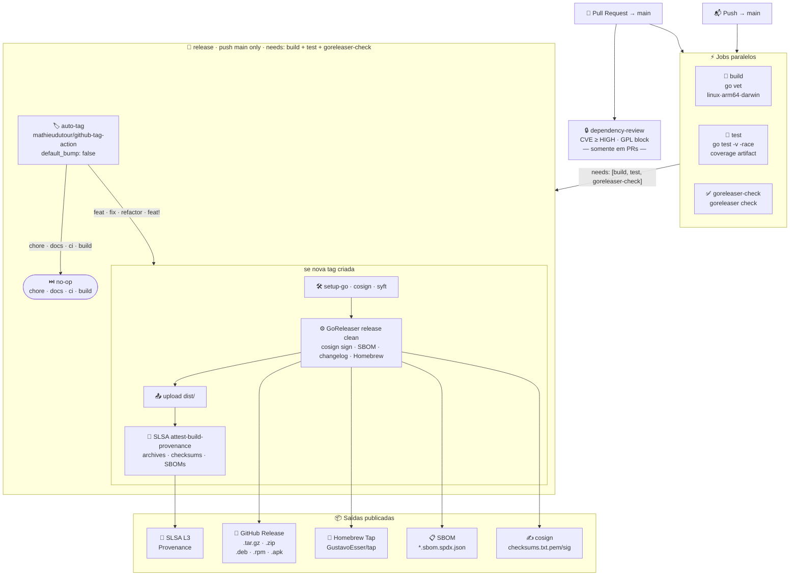

# Pipeline A3K

Workflow unificado de CI/CD — `pipeline.yml`.

---

## Arquitetura do Pipeline



---

## Convenção de commits → versão

| Prefixo | Bump semver | Exemplo |
|---------|-------------|---------|
| `feat:` | **minor** `v1.0.0 → v1.1.0` | `feat: add namespace filter` |
| `fix:` · `refactor:` | **patch** `v1.0.0 → v1.0.1` | `fix: nil pointer on empty cluster` |
| `feat!:` · `BREAKING CHANGE` | **major** `v1.0.0 → v2.0.0` | `feat!: redesign CLI flags` |
| `chore:` · `docs:` · `ci:` · `build:` | **sem release** | `chore: update deps` |

---

## Jobs detalhados

### build

Verifica compilação nas três plataformas alvo.

| Passo | Comando |
|-------|---------|
| `go vet` | `go vet ./...` |
| linux/amd64 | `CGO_ENABLED=0 go build -trimpath -o /dev/null .` |
| linux/arm64 | `CGO_ENABLED=0 GOARCH=arm64 go build -trimpath -o /dev/null .` |
| darwin/arm64 | `CGO_ENABLED=0 GOOS=darwin GOARCH=arm64 go build -trimpath -o /dev/null .` |

> `CGO_ENABLED=0` gera binários estáticos sem dependência de libc — obrigatório para cross-compile e para evitar `dyld: missing LC_UUID` no macOS 26.

### test

```bash
go test -v -race -coverprofile=coverage.out ./...
```

`coverage.out` salvo como artifact por 7 dias.

### goreleaser-check

```bash
goreleaser check
```

Valida `.goreleaser.yaml` sem compilar. Bloqueia a tag antes de uma config inválida chegar no release.

### dependency-review *(PRs only)*

- Bloqueia deps com CVE severity ≥ **HIGH**
- Bloqueia licenças: `GPL-2.0`, `GPL-3.0`, `AGPL-3.0`
- Resultado comentado diretamente no PR

### release *(push main — needs: build + test + goreleaser-check)*

**Passo 1 — auto-tag**

`mathieudutour/github-tag-action@v6.2` calcula a próxima versão semver pelo histórico de commits e cria a tag. Com `default_bump: false`, commits `chore/docs/ci/build` não geram tag — o job termina como no-op.

**Passo 2 — GoReleaser** *(condicional: somente se nova tag foi criada)*

| Ferramenta | Papel |
|------------|-------|
| `cosign` (sigstore) | Assina `checksums.txt` via OIDC keyless |
| `syft` (anchore) | Gera SBOM em formato SPDX JSON |
| `goreleaser ~> v2` | Orquestra build · empacotamento · publicação |

Artefatos gerados em `dist/`:

```
a3k_vX.Y.Z_linux_amd64.tar.gz     a3k_vX.Y.Z_linux_amd64.deb
a3k_vX.Y.Z_linux_arm64.tar.gz     a3k_vX.Y.Z_linux_arm64.deb
a3k_vX.Y.Z_darwin_amd64.tar.gz    a3k_vX.Y.Z_linux_amd64.rpm
a3k_vX.Y.Z_darwin_arm64.tar.gz    a3k_vX.Y.Z_linux_arm64.rpm
a3k_vX.Y.Z_windows_amd64.zip      a3k_vX.Y.Z_linux_amd64.apk
                                   a3k_vX.Y.Z_linux_arm64.apk
a3k_vX.Y.Z_*.sbom.spdx.json       ← SBOM por plataforma
checksums.txt                      ← SHA256 de todos os assets
checksums.txt.pem / .sig           ← certificado e assinatura cosign
```

Além dos arquivos:
- **GitHub Release** criada com changelog agrupado por tipo de commit
- **Homebrew Tap** (`GustavoEsser/homebrew-tap`) atualizado automaticamente

**Passo 3 — SLSA Attestation**

| Attestation | Arquivos |
|-------------|---------|
| Archives | `dist/*.tar.gz` · `dist/*.zip` · `dist/checksums.txt` |
| SBOMs | `dist/*.sbom.spdx.json` |

---

## Permissões

| Job | Permissões |
|-----|-----------|
| `build`, `test`, `goreleaser-check` | `contents: read` (herda global) |
| `dependency-review` | `contents: read` · `pull-requests: write` |
| `release` | `contents: write` · `id-token: write` · `attestations: write` |

> `id-token: write` é obrigatório para o cosign obter o token OIDC do GitHub (assinatura keyless).

---

## Segredos necessários

| Secret | Onde configurar | Uso |
|--------|----------------|-----|
| `GITHUB_TOKEN` | Automático (GitHub Actions) | Criar tag · GitHub Release · upload assets |
| `HOMEBREW_TAP_GITHUB_TOKEN` | Settings → Secrets → Actions | `contents: write` no repo `GustavoEsser/homebrew-tap` |

---

## Uso

### Release automático

```bash
# patch  →  v1.0.0 → v1.0.1
git commit -m "fix: corrige nil pointer quando cluster está vazio"
git push origin main

# minor  →  v1.0.0 → v1.1.0
git commit -m "feat: adiciona filtro por namespace"
git push origin main

# major  →  v1.0.0 → v2.0.0
git commit -m "feat!: redesenha flags do CLI"
git push origin main

# sem release
git commit -m "chore: atualiza dependências"
git push origin main
```

Tempo total (build → test → goreleaser-check → auto-tag → goreleaser → attest): **~5–8 min**.

### Release manual

```bash
git tag -a v1.2.0 -m "Release v1.2.0"
git push origin v1.2.0
```

### Verificar assinatura cosign

```bash
cosign verify-blob \
  --certificate-identity-regexp="https://github.com/GustavoEsser/a3k/.github/workflows/pipeline.yml" \
  --certificate-oidc-issuer="https://token.actions.githubusercontent.com" \
  --cert checksums.txt.pem \
  --signature checksums.txt.sig \
  checksums.txt
```

---

## Instalação

**Homebrew**
```bash
brew tap GustavoEsser/tap && brew install a3k
```

**Go install**
```bash
go install github.com/flysecurity/a3k@latest
```

**Download direto**
```bash
curl -Lo a3k.tar.gz \
  https://github.com/GustavoEsser/a3k/releases/latest/download/a3k_$(uname -s | tr '[:upper:]' '[:lower:]')_$(uname -m).tar.gz
tar -xzf a3k.tar.gz && ./a3k --help
```

---

## Estrutura

```
.github/
├── README.md          ← este arquivo
└── workflows/
    └── pipeline.yml   ← workflow unificado (CI + security + release)

.goreleaser.yaml       ← configuração GoReleaser v2
.golangci.yml          ← configuração linters
```
